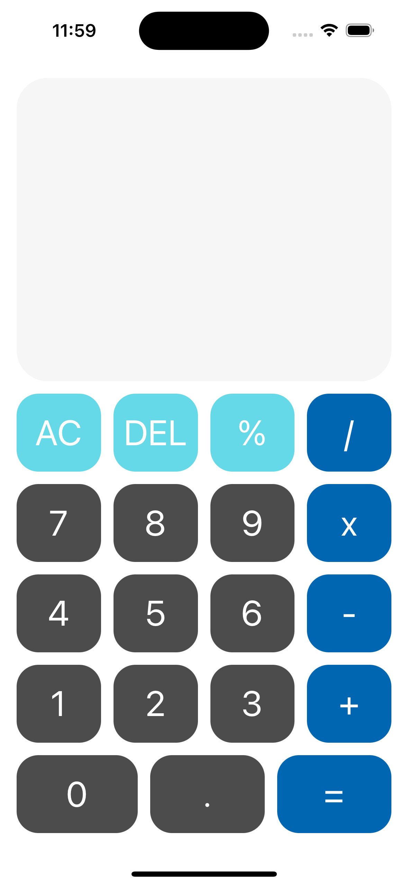
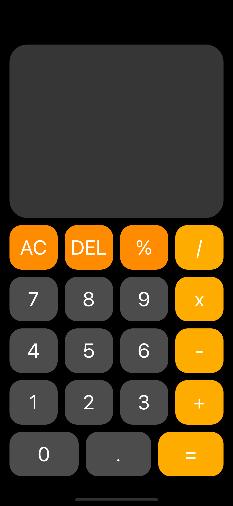
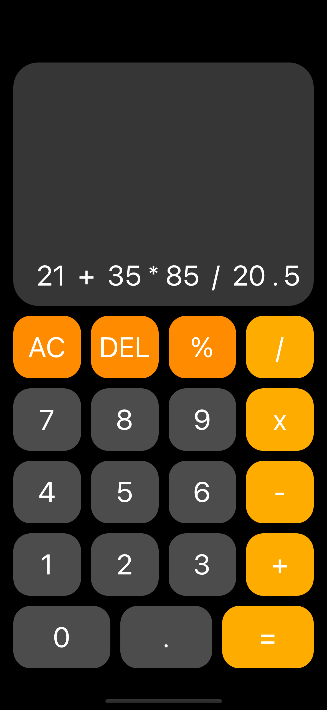

# Calculator App
This is a simple calculator app built using SwiftUI. The app has a clean and user-friendly interface, allowing users to perform simple calculations.

## Installation
To install the app, simply clone or download the repository and open it in Xcode. You can then run the app in the simulator or on a connected iOS device.

## Usage
The calculator allows users to perform basic arithmetic calculations such as addition, subtraction, multiplication, and division. It also includes functionality for clearing the display and deleting the last entered character.

## Screeshots

  
   
  

## Buttons
The calculator has the following buttons:

- AC: clears the entire display
- DEL: deletes the last entered character
- %: calculates the percentage of a number
- /: divides the previous number by the entered number
- x: multiplies the previous number by the entered number
- -: subtracts the entered number from the previous number
- +: adds the entered number to the previous number
- .: adds a decimal point to the entered number
- =: calculates the result of the entered expression

## Code Structure
### ContentView.swift
This file contains the ContentView struct which defines the main user interface of the app. The @State variables expressions and lastIsNum are used to store the current expression being entered and whether the last input was a number or not.

The appendDigit function is used to add a digit or operator to the current expression. The solve function is used to evaluate the expression and display the result. The clear function is used to clear the display. The convertFloat function is used to convert integers to floats in the expression.

### ButtonView.swift
This file contains the ButtonView struct which defines the appearance of each button in the calculator. The buttonText, color, size, and action properties are used to customize the button.

### ResultsView.swift
This file contains the ResultsView struct which displays the current expression being entered or the result of a calculation. The displayValue property is used to display the expression or result.

## Display
The display shows the numbers and operations entered by the user and the result of the calculation.

## Author
This app was created by Fatih Şükran on 1.04.2023.
